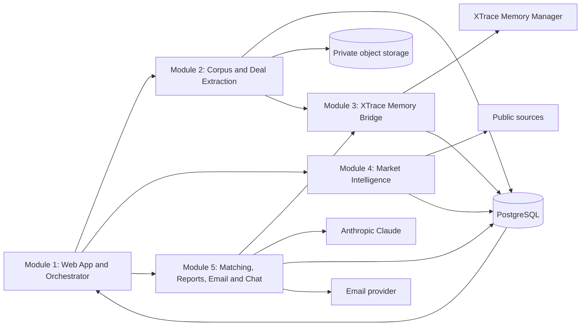

# XTrace VC Deal Intelligence Demo — Integration Design

Date: 2026-07-23  
Status: Approved  
Target: two-week public hackathon demo

## 1. Product definition

The product is a web-based deal intelligence analyst for a small or medium VC fund. It preserves the context behind historical deal decisions, monitors public information from the latest 14 days, and reconnects relevant market events with companies the fund has previously reviewed.

The primary user is an individual Partner or GP. The data model reserves a workspace and user boundary so the product can later support multiple people, but authentication and workspace management are not part of this demo.

The core demo promise is:

> A market change should cause the system to recall a relevant historical deal, explain the prior investment context, and show the evidence that makes the company worth another look.

The product does not autonomously make an investment decision. It provides a ranked, evidence-backed reason to investigate.

## 2. Scope decisions

### 2.1 Included

- Public web app using the existing frontend design.
- One shared demo workspace.
- A preloaded corpus consisting of the supplied pitch decks and market reports.
- A full Import flow that lets the user select a preloaded document, review the detected company and Deal association, and confirm processing.
- Explicitly labeled synthetic VC interaction and decision records for selected companies.
- PostgreSQL persistence for documents, deals, events, runs, reports, messages, and external-service mappings.
- Private object storage for original source documents, exposed through short-lived signed URLs.
- XTrace Memory Manager integration for ingest and recall.
- Anthropic Claude integration for structured extraction, matching, ranking, reporting, and grounded chat responses.
- Manual scans of public information published in the latest 14 days.
- A market summary on every successful run, even when no opportunity reaches the alert threshold.
- Medium- and high-confidence opportunity alerts only.
- Top-five ranked results across all historical Deal states.
- Persistent reports and run history.
- Real email delivery for the VC report and optional founder outreach.
- Search and grounded Chat over existing system data only.
- A functional XTrace ON/OFF comparison control.

### 2.2 Excluded

- Real file upload from the user's device.
- Audio recording, speech transcription, Gmail, Google Drive, Slack, or Calendar connections.
- Scheduled background scans; the user starts a scan with a button.
- Autonomous investment decisions.
- Automatic founder follow-up.
- Live web browsing from Chat.
- Multi-user authentication, permissions, or billing.
- Fabricated news, fabricated company developments, or fabricated citations.

## 3. Data truth policy

Every piece of displayed information has a provenance class.

| Provenance | Meaning | May support an external factual claim? | UI treatment |
| --- | --- | --- | --- |
| `source_document` | Extracted from a supplied real PDF | Yes | Source title and page |
| `public_web` | Extracted from a fetched public page or feed | Yes | Publisher, date, URL |
| `demo_fixture` | Synthetic private VC note or decision created for the demo | No | Permanent “Demo fixture” badge |
| `model_inference` | A conclusion produced from cited evidence | Only as an inference | “AI inference” label plus citations |

The system must never present a `demo_fixture` as a real statement made by an investor, founder, or company. Synthetic records may contain:

- meeting notes;
- Deal status;
- internal concerns;
- pass or watch rationale;
- revisit conditions;
- internal partner comments.

Company, market, funding, customer, regulatory, and product claims must come from `source_document` or `public_web` evidence.

## 4. Fixed demo corpus

The seed corpus contains thirteen product inputs plus one reference-only document.

### 4.1 Deal documents

1. 7bridges Pitch Deck
2. 100Plus Pitch Deck
3. 1906 Pitch Deck
4. A-Champs Pitch Deck
5. Ably Pitch Deck
6. Acin Pitch Deck
7. Acquco Pitch Deck
8. Ada Health Pitch Deck
9. Pitch-combined / InterTwin AI

### 4.2 Market reports

1. 2026 US Venture Capital Outlook — Midyear Update
2. Q1 2026 AI VC Trends
3. Q1 2026 Robotics and Physical AI VC Trends
4. Silicon Photonics 2024: SOI, SiN and LNO

### 4.3 Reference-only document

1. The VC Brain

The reference-only document can guide fixture shape and product terminology but cannot be treated as a Deal or market event.

The application chooses the three to five featured Deal scenarios by measuring overlap between facts in the pitch decks and themes in the market reports. The selected Deals receive synthetic internal records. All other companies remain queryable and can appear in later rankings if public evidence supports them.

## 5. Architecture



The Next.js web app is deployable on Vercel. Long-running scans execute through a separate worker service so they do not depend on a browser tab or a Vercel request remaining open. PostgreSQL is the source of truth for application state. XTrace is the long-term semantic memory layer, not the primary database. Claude is the reasoning model, not the memory store.

Secrets for XTrace, Anthropic, object storage, database, and email remain server-side. XTrace calls are proxied through the backend, consistent with XTrace's requirement not to expose its API key in the browser.

## 6. Five module specifications

### 6.1 Module 1 — Web App and Orchestrator

#### Responsibility

Preserve the current visual language while replacing every prototype-only interaction with a persistent operation.

#### Required screens

- Overview: latest market summary, Top 5 opportunities, scan status, and memory health.
- Deals: searchable Deal list with status, sector, last interaction, and source count.
- Deal detail: facts, interaction timeline, decision context, revisit conditions, and source documents.
- Market: normalized events from the latest 14 days with filters and evidence.
- Import: preloaded corpus picker, classification preview, company/Deal confirmation, and processing result.
- Reports: persistent report list and report detail.
- Runs: current and historical run states, provider results, warnings, and failures.
- Chat: grounded questions over existing Deal, event, report, and memory data.
- Settings: server-side integration health and email recipient configuration; never reveal secret values.

#### Orchestration rules

- `Run scan` creates a persisted run and returns immediately.
- The UI polls run status and renders stage-by-stage progress.
- Refreshing or closing the browser does not lose progress.
- Duplicate button presses for the same workspace and 14-day window return the active run instead of creating another.
- The XTrace toggle is stored per run. ON uses XTrace recall; OFF uses only PostgreSQL full-text/structured retrieval. Both modes use the same market events and ranking prompt so the comparison is meaningful.

#### Dependencies

Module 1 consumes only documented HTTP endpoints and shared schemas. It must not import internal worker or provider code.

### 6.2 Module 2 — Corpus and Deal Extraction

#### Responsibility

Turn the fixed source corpus and synthetic private interaction fixtures into normalized, traceable records.

#### Import behavior

- The Import screen is labeled “Demo corpus preloaded.”
- It does not open an operating-system file picker.
- A user selects one or more existing corpus documents.
- The backend returns a classification preview: `deal_document`, `market_report`, or `reference`.
- For a Deal document, the user confirms the detected company and target Deal.
- Confirmation creates or updates the workspace association and starts idempotent extraction.
- The original document already exists in private object storage and is not uploaded again.

#### Extraction outputs

- document metadata and checksum;
- company identity and aliases;
- sector tags;
- business model;
- product and customer facts;
- stage and disclosed metrics;
- source-located evidence excerpts;
- interaction records and decision context for `demo_fixture` inputs.

Every extracted fact stores document ID, page number when available, source excerpt, provenance class, extractor version, and extraction timestamp.

#### Idempotency

`workspace_id + document_checksum + extractor_version` is the extraction key. Reprocessing the same version returns the existing result.

#### Dependencies

Module 2 writes PostgreSQL and object-storage metadata, calls Claude for structured extraction, and emits a `DealMemoryBundle` to Module 3.

### 6.3 Module 3 — XTrace Memory Bridge

#### Responsibility

Provide one server-side interface for XTrace ingest, job polling, search, and recall while preserving application-level traceability in PostgreSQL.

#### Ingest model

Each Deal receives a stable conversation namespace:

- `user_id`: demo workspace user;
- `conv_id`: stable per Deal interaction or import;
- `app_id`: XTrace Hackathon web app;
- metadata embedded in content: Deal ID, source IDs, provenance labels, date, status, and fixture markers.

The bridge submits message turns to XTrace, stores the returned job ID, polls asynchronously, and stores created memory IDs and status locally. It uses exponential backoff and respects the 30 requests-per-minute account limit.

#### Recall model

The bridge exposes:

```ts
recallDealContext({
  workspaceId,
  query,
  candidateDealIds,
  limit
}): Promise<MemoryContext[]>
```

Returned context includes the local Deal ID, XTrace memory ID, memory type, text, score, provenance, and source references. Module 5 must not use raw XTrace results without resolving them back to local evidence.

#### Quota control

- Ingest one curated interaction bundle per Deal scenario, not one request per PDF page.
- Cache successful recalls per run and query fingerprint.
- Stop before quota exhaustion and show a visible warning.
- Failed XTrace jobs remain retryable from Runs.

#### ON/OFF behavior

- ON: semantic candidate context comes from XTrace, then is resolved against PostgreSQL evidence.
- OFF: candidate context comes from structured Deal fields and PostgreSQL text search.
- XTrace unavailability does not silently switch the toggle. The run is marked `partial` and may be explicitly retried or rerun in OFF mode.

### 6.4 Module 4 — Market Intelligence

#### Responsibility

Collect, normalize, deduplicate, and summarize public information from the latest 14 days.

#### Provider strategy

The provider interface supports:

- official company and VC announcements;
- official regulatory and government feeds or APIs;
- stable publisher RSS feeds;
- configured funding-data providers when an authorized API key is available.

Social-media scraping is not a required dependency because it is brittle and often requires authentication. A social post may be used only when a stable public URL is available and its fetch succeeds.

Each provider returns a common `RawSourceItem`. Normalization produces a `MarketEvent`.

#### Market event requirements

- title;
- event type;
- affected sectors and themes;
- occurrence or publication time;
- factual summary;
- potential positive and negative industry effects;
- publisher and canonical URL;
- retrieved timestamp;
- evidence excerpt;
- confidence;
- content checksum.

Events are deduplicated by canonical URL, normalized entity/date, and semantic similarity. Recency is calculated from the event's publication time, not fetch time.

#### Run behavior

- A manual scan covers `now - 14 days` through `now`.
- Provider failures are isolated; one failure does not cancel the run.
- The run records per-provider counts, errors, and last-success timestamps.
- Previously fetched evidence can be reused but is labeled with its original publication and retrieval dates.
- The system never invents a current event to keep the demo populated.
- A daily market summary is created even if no event matches a historical Deal.

### 6.5 Module 5 — Matching, Reports, Email, and Chat

#### Responsibility

Connect normalized market events to historical Deal context, rank review candidates, create reports, deliver email, and answer grounded questions.

#### Candidate set

All Deal states participate:

- `screening`;
- `watchlist`;
- `evaluating`;
- `passed`;
- `invested`.

The old `interested` label is normalized to `watchlist`.

#### Matching stages

1. Retrieve candidate Deals using sector, theme, entity, and semantic overlap.
2. Recall prior context through Module 3 when XTrace is ON.
3. Ask Claude for a structured assessment using only supplied context.
4. Resolve every factual statement to source evidence.
5. Score event relevance, Deal relevance, prior-context strength, and evidence quality.
6. Keep only medium- or high-confidence matches.
7. Rank and store at most five opportunities.

An opportunity contains:

- Deal identity and current status;
- `why_now`;
- prior interaction and decision context;
- relevant market events;
- positive and negative implications;
- recommended investigation step;
- confidence and score breakdown;
- source citations;
- an explicit list of Demo fixtures used.

The model must return “insufficient evidence” instead of filling missing fields.

#### Reports and email

- Each completed or partial run creates one persistent report.
- A report contains the market summary even when the Top 5 list is empty.
- Email delivery is a separate retryable job.
- The VC report email is sent to the configured recipient and links back to the report.
- Founder outreach is generated only after the user selects an opportunity. It is editable and must be explicitly sent.
- Email provider message IDs and delivery status are persisted.

#### Chat and Search

- Search performs deterministic filtering and text search over existing entities.
- Chat retrieves existing Deal, document, event, report, and XTrace memory context.
- Chat never starts a web search and never modifies Deal state.
- Answers contain source links or state that the available data is insufficient.

## 7. Shared contracts

The following contracts are versioned in a shared package or directory and are the only cross-module data exchange types:

```ts
type Provenance = "source_document" | "public_web" | "demo_fixture" | "model_inference";
type DealStatus = "screening" | "watchlist" | "evaluating" | "passed" | "invested";
type RunStatus = "queued" | "running" | "partial" | "completed" | "failed";

interface SourceRef {
  id: string;
  provenance: Provenance;
  title: string;
  url?: string;
  documentId?: string;
  page?: number;
  publisher?: string;
  publishedAt?: string;
  excerpt: string;
}

interface DealMemoryBundle {
  dealId: string;
  companyName: string;
  status: DealStatus;
  facts: Array<{ text: string; sources: SourceRef[] }>;
  interactions: Array<{
    occurredAt: string;
    summary: string;
    concerns: string[];
    revisitConditions: string[];
    provenance: "demo_fixture";
  }>;
}

interface MarketEvent {
  id: string;
  title: string;
  eventType: string;
  sectors: string[];
  themes: string[];
  summary: string;
  positiveImplications: string[];
  negativeImplications: string[];
  publishedAt: string;
  confidence: "low" | "medium" | "high";
  sources: SourceRef[];
}

interface OpportunityReportItem {
  rank: number;
  dealId: string;
  confidence: "medium" | "high";
  score: number;
  whyNow: string;
  previousContext: string;
  implications: { positive: string[]; negative: string[] };
  nextStep: string;
  sources: SourceRef[];
  demoFixtureIds: string[];
}
```

Runtime validation is required at every network and model boundary. TypeScript types alone are not sufficient.

## 8. Minimum HTTP interface

```text
GET    /api/overview
GET    /api/deals
GET    /api/deals/:id
GET    /api/documents
POST   /api/imports/preview
POST   /api/imports/confirm
POST   /api/runs
GET    /api/runs
GET    /api/runs/:id
POST   /api/runs/:id/retry
GET    /api/market/events
GET    /api/reports
GET    /api/reports/:id
POST   /api/reports/:id/email
POST   /api/opportunities/:id/outreach
GET    /api/search
POST   /api/chat
GET    /api/settings/health
PATCH  /api/settings
```

Long-running endpoints enqueue work and return `202` with a persisted job or run ID.

## 9. Persistence model

Minimum relational entities:

- `workspaces`
- `users`
- `documents`
- `document_workspace_links`
- `document_extractions`
- `source_evidence`
- `companies`
- `deals`
- `deal_aliases`
- `interactions`
- `decision_contexts`
- `xtrace_ingest_jobs`
- `xtrace_memories`
- `market_sources`
- `market_events`
- `market_event_sources`
- `scan_runs`
- `scan_run_steps`
- `opportunity_matches`
- `reports`
- `email_deliveries`
- `chat_threads`
- `chat_messages`

Every table that contains workspace-owned data includes `workspace_id`. External IDs are never used as primary keys. Deleting or rebuilding demo data is performed only by an explicit seed command, never on application startup.

## 10. Failure handling

- External calls have timeouts, bounded retries, and recorded error details.
- Provider errors produce a partial run when at least one usable source succeeds.
- A run fails only when it cannot produce a truthful market summary.
- Model output that fails schema validation is retried once with a repair prompt, then recorded as a failed step.
- Missing citations remove the unsupported claim from the report.
- XTrace ingest and recall failures are visible and retryable.
- Email failure does not change a completed report into a failed report.
- UI errors include a recovery action and never display a false success state.

## 11. Testing strategy

### Unit

- provenance enforcement;
- status normalization;
- event recency and deduplication;
- score thresholds;
- source resolution;
- schema validation;
- XTrace quota throttling;
- email rendering.

### Contract

- every provider against `RawSourceItem`;
- Claude responses against extraction, event, matching, report, and chat schemas;
- XTrace adapter against recorded API-shaped fixtures;
- HTTP endpoints against shared request/response schemas.

### Integration

- seed corpus to Deal records;
- Deal bundle to XTrace ingest-job persistence;
- 14-day scan to normalized events;
- event plus memory to a cited opportunity;
- completed report to email delivery.

### End-to-end

1. Open the public demo.
2. Select a preloaded pitch deck in Import.
3. Confirm company and Deal association.
4. Observe persisted extraction and XTrace ingest state.
5. Start a 14-day scan.
6. Refresh while the worker continues.
7. Open a completed report with a market summary and ranked opportunities.
8. Inspect both document and public-web evidence.
9. Compare XTrace ON and OFF behavior.
10. Send the VC report email.
11. Ask Chat a grounded question and open its citations.

## 12. Success criteria

The demo is successful when:

- all required user actions work after a full page refresh;
- at least one opportunity connects a real market source to a real pitch-deck company;
- the prior VC decision context is clearly labeled as a Demo fixture;
- every factual claim in an alert opens a source document page or public URL;
- XTrace ON retrieves relevant historical context and exposes its memory lineage;
- XTrace OFF remains functional but does not use XTrace results;
- the report includes only medium- or high-confidence alerts;
- a scan with no qualifying opportunity still produces a truthful market summary;
- a real email reaches the configured address;
- no secret is present in browser JavaScript or committed files;
- the existing visual design remains recognizably intact.
