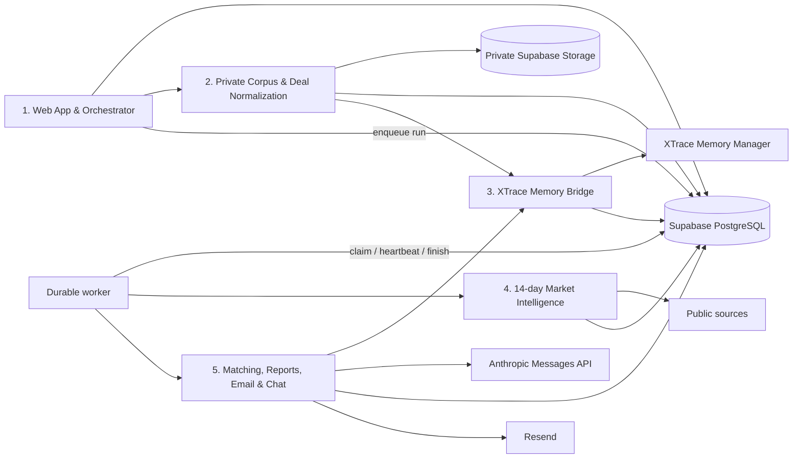

# VSee VC Deal Intelligence — Integration Specification

Date: 2026-07-24
Status: current source of truth for the two-week public Hackathon demo

## 1. Product outcome

VSee is a public, single-workspace Web App for a small or medium VC fund's
Partner or GP. It detects changes in the market first, then reconnects those
events with every previously reviewed Deal that may be affected.

The product solves the expensive part of Deal sourcing: the fund cannot
continuously remember and revisit hundreds of companies it met but did not
invest in. VSee does not make an investment decision or claim that a company
has improved. It produces a cited reason for an investor to investigate again.

The core workflow is:

1. preserve source-backed facts and synthetic historical decision context;
2. fetch public evidence published in the latest 14 days;
3. identify market changes and events with possible industry effects;
4. recall historical Deals that overlap with those events;
5. keep only medium/high-confidence matches and rank at most five;
6. always produce a market summary, even when there are no matches;
7. let the investor inspect citations, send the real report email, and query
   stored data through Chat.

## 2. Confirmed scope

### Included

- Public Web App; no desktop installer.
- One shared demo workspace and one primary user experience.
- Supplied PDF corpus preloaded into a private Supabase Storage bucket.
- Short-lived signed links so a user can inspect original private sources and
  cited pages.
- A visible import/confirmation flow over the preloaded corpus; there is no
  operating-system file picker in this demo.
- Supabase PostgreSQL as the durable application source of truth.
- A separately running, PostgreSQL-backed worker for long-running scans.
- XTrace Memory Manager for long-term Deal-memory ingest and recall.
- Anthropic Messages API for evidence-constrained reasoning.
- A real, manual public-market scan over the latest 14 days.
- Event-first matching against all Deal states: `screening`, `watchlist`,
  `evaluating`, `passed`, and `invested`.
- A market summary for every truthful completed/partial report.
- Medium- and high-confidence opportunities only, ranked to Top 5.
- Real VC report delivery through Resend to configured recipients.
- Chat that answers from already stored Deal, source, market-event, report, and
  resolved XTrace memory data only.
- Permanently labeled synthetic VC decision records for the demo.

### Excluded

- Audio, recording, speech-to-text, Gmail, Google Drive, Slack, or Calendar.
- Runtime upload of arbitrary local files.
- Automatic scheduled scans; the user presses **Run 14-day scan**.
- Social-network scraping that requires authentication.
- Automatic company-progress diligence after a market match.
- Founder outreach generation or delivery.
- Autonomous investment decisions or automatic founder follow-up.
- Chat browsing the Web, starting a scan, sending email, or mutating Deal data.
- Multi-user login, access-control UI, billing, or organization administration.
- Fabricated news, company progress, citations, or delivery state.

## 3. Data truth and corpus policy

### Provenance classes

| Provenance | Meaning | Allowed use |
| --- | --- | --- |
| `source_document` | Verifiable fact from a supplied PDF | Company or baseline market fact, with document ID/page/excerpt |
| `public_web` | Fact from a fetched public source | Current market event, with publisher/date/URL/excerpt |
| `demo_fixture` | Synthetic internal VC history | Deal status, concerns, pass/watch rationale, revisit conditions |
| `model_inference` | Claude conclusion over cited evidence | Explanation only; never a new external fact |

Every synthetic record must use this exact visible label:

> Synthetic VC decision record created for the hackathon demo

No public or company claim may be supported by `demo_fixture` alone. Every
displayed external factual claim must resolve to a `source_document` or
`public_web` `SourceRef`. Unsupported model claims are removed.

### Supplied corpus

The repository contains 14 supplied PDFs:

- nine pitch-deck files;
- four market reports;
- one reference-only VC Brain document.

Eight files map one-to-one to Deals: 7bridges, 100Plus, 1906, A-Champs, Ably,
Acin, Acquco, and Ada Health.

`Pitch-combined-InterTwin-AI.pdf` remains one private source object and is split into 11
page-scoped Deals:

| Page | Deal |
| ---: | --- |
| 1 | InterTwin.ai |
| 2 | UniKudo |
| 3 | Mirror |
| 4 | CouPro |
| 5 | IndieShow |
| 6 | HuMetric |
| 7 | Alpha Builders |
| 8 | INNFormNest |
| 9 | SilverMemory |
| 10 | Kanesh |
| 11 | Fellowtrip |

The fixed corpus therefore produces 19 Deal records from nine pitch-deck
files. Every fact, memory bundle, candidate match, and source link derived from
the combined PDF must retain its Deal-specific page number. The system must not
merge those companies into one Deal or upload 11 duplicate PDF objects.

The four supplied market reports form cited baseline context. They do not
replace the live scan: each run still fetches public items dated within its
14-day window.

## 4. Runtime architecture



The browser is not a trusted data client. It calls Web App API routes only.
Those routes and the worker use the Supabase service role server-side. Database
tables have RLS enabled without browser-facing policies, and private objects
are exposed only through expiring signed URLs.

XTrace and Anthropic are separate services:

- XTrace stores and recalls long-lived semantic Deal context.
- PostgreSQL stores authoritative entities, run state, source lineage, reports,
  and XTrace-to-local mappings.
- Anthropic reasons only over evidence supplied by the application.

An XTrace-enabled run may not silently fall back to structured retrieval. If
XTrace is unavailable, the run is visibly partial and the user may retry or
explicitly run with XTrace OFF.

## 5. Five modules and parallel ownership

The modules follow the data flow. Each has a stable boundary so five developers
or agents can work in parallel using contract fixtures.

### Module 1 — Web App and Orchestrator

**Owns**

- existing dark/lime visual design and responsive navigation;
- Overview, Deals, Sources/Import, Market, Reports, Runs, Chat, Settings;
- import preview followed by explicit company/Deal confirmation;
- Run creation, polling, stage display, warnings, and XTrace mode selection;
- report inspection, citation links, and explicit report-email send;
- health checks that distinguish Web, PostgreSQL, worker, XTrace, Anthropic,
  market providers, Storage, and Resend readiness.

**Rules**

- `POST /api/runs` persists a queued run and returns immediately.
- The worker must be healthy and durable PostgreSQL configured before the UI
  enables a deployed scan.
- Refreshing or closing the browser never cancels a run.
- The XTrace control reflects configured capability and the selected run mode;
  it must not claim XTrace was used when recall failed.
- UI source links include the document page where available.
- Public mutations are rate-limited; report delivery is recipient-allowlisted.

**Consumes**

`DocumentPreview`, `Run`, `RunStep`, `DealSummary`, `MarketEvent`,
`OpportunityReport`, `ChatAnswer`, `IntegrationHealth`.

### Module 2 — Private Corpus and Deal Normalization

**Owns**

- manifest checksums and source metadata;
- seed upload to private Supabase Storage;
- fixed-corpus preview, company/Deal confirmation, and idempotent extraction;
- page-level source evidence and permanently labeled decision fixtures;
- creation of `DealMemoryBundle`.

**Rules**

- Original PDFs remain in private cloud storage.
- A stored source is accessed through a ten-minute signed read URL.
- Idempotency key: `workspace_id + document_checksum + extractor_version`.
- One stored `Pitch-combined-InterTwin-AI.pdf` object creates the 11 page-scoped Deals
  defined in Section 3.
- There is no audio, image OCR, Gmail/Drive ingest, or arbitrary upload in MVP.

**Produces**

`SourceDocument`, `SourceRef`, `Deal`, `DealMemoryBundle`.

### Module 3 — XTrace Memory Bridge

**Owns**

- server-side XTrace client;
- asynchronous ingest submission and job polling;
- request throttling below the account's 30 requests/minute limit;
- stable per-Deal conversation IDs;
- local lineage from XTrace job/memory IDs to Deal/source/fixture IDs;
- evidence-resolved Deal recall.

**Rules**

- One curated memory bundle per eligible Deal, not one request per page.
- API keys never enter browser JavaScript.
- Raw XTrace text cannot become a citation. Each returned memory must resolve to
  local source IDs or labeled fixture IDs before Module 5 may use it.
- Candidate Deal IDs scope every recall.
- Pending/running jobs are durable and completed by the worker.
- XTrace errors are visible; ON never silently becomes OFF.

**Produces**

```ts
interface MemoryContext {
  dealId: string;
  memoryId: string;
  memoryType?: string;
  text: string;
  score: number;
  provenance: Provenance;
  sourceIds: string[];
  fixtureIds: string[];
}
```

### Module 4 — 14-day Market Intelligence

**Owns**

- live fetch from configured official/regulatory feeds and stable publisher
  feeds, with optional authorized Crunchbase;
- Federal Register, FDA, SEC, FTC, TechCrunch venture, and configured RSS
  provider adapters;
- recency filtering, normalization, checksum/canonical-URL deduplication;
- event and industry-effect extraction;
- per-provider result/error reporting;
- truthful market summary, supplemented by supplied report baselines.

**Rules**

- Scan window is `[run time - 14 days, run time]`, using publication time.
- Provider failures are isolated.
- No current event is fabricated to populate the demo.
- Every `MarketEvent` includes at least one public URL, publisher, publication
  time, and evidence excerpt.
- Market/event detection happens before historical Deal matching.

**Produces**

`MarketScanResult { events, providerResults, marketSummary, warnings }`.

### Module 5 — Matching, Reports, Email, and Chat

**Owns**

- event-first candidate retrieval across every Deal status;
- XTrace ON or explicitly structured OFF context acquisition;
- Anthropic structured assessment;
- claim-level source validation;
- confidence filtering and Top 5 ranking;
- persistent reports and Resend delivery;
- existing-data-only Chat with claim-level citations.

**Matching gates**

1. Start with normalized current `MarketEvent` records.
2. Find overlapping Deals by sector/theme/entity and allowed memory recall.
3. Require at least one current `public_web` source and one Deal-lineage source
   (`source_document` or labeled `demo_fixture`).
4. Ask Anthropic for `whyNow`, `previousContext`, positive/negative
   implications, and a human review/follow-up step.
5. Remove every unsupported claim and reject unsafe investment instructions.
6. Keep only `medium` or `high` confidence and rank at most five.
7. Persist the report even when no opportunity survives.

**Email**

- Only the configured default/allowed recipient can receive a report.
- A report is sent once unless an explicit retry policy allows another attempt.
- Provider response ID and delivery status are persisted.
- The email contains the market summary, ranked opportunities, and source/deep
  links to the Web App; it is not founder outreach.

**Chat**

- Retrieves only stored Deal evidence, fixtures, market events, reports, and
  resolved XTrace memory.
- Does not call market providers or arbitrary URLs.
- Rebuilds the final answer only from individually supported claims.
- Returns an explicit insufficient-evidence response when support is missing.

## 6. Cross-module contracts

Runtime validation is mandatory at HTTP, provider, XTrace, and Anthropic
boundaries.

```ts
type Provenance =
  | "source_document"
  | "public_web"
  | "demo_fixture"
  | "model_inference";

type DealStatus =
  | "screening"
  | "watchlist"
  | "evaluating"
  | "passed"
  | "invested";

type RunStatus = "queued" | "running" | "partial" | "completed" | "failed";
type Confidence = "low" | "medium" | "high";

interface SourceRef {
  id: string;
  provenance: Provenance;
  title: string;
  url?: string;
  documentId?: string;
  page?: number;
  publisher?: string;
  publishedAt?: string;
  excerpt: string;
}

interface DealMemoryBundle {
  dealId: string;
  companyName: string;
  status: DealStatus;
  facts: Array<{ text: string; sources: SourceRef[] }>;
  interactions: Array<{
    id: string;
    occurredAt: string;
    summary: string;
    concerns: string[];
    revisitConditions: string[];
    provenance: "demo_fixture";
    label: "Synthetic VC decision record created for the hackathon demo";
  }>;
}

interface MarketEvent {
  id: string;
  title: string;
  eventType: string;
  sectors: string[];
  themes: string[];
  summary: string;
  positiveImplications: string[];
  negativeImplications: string[];
  publishedAt: string;
  confidence: Confidence;
  sources: SourceRef[];
}

interface OpportunityReportItem {
  rank: number;
  dealId: string;
  confidence: "medium" | "high";
  score: number;
  whyNow: string;
  previousContext: string;
  implications: { positive: string[]; negative: string[] };
  nextStep: string;
  sources: SourceRef[];
  demoFixtureIds: string[];
}
```

## 7. HTTP surface

Implemented/required demo endpoints:

```text
GET    /api/overview
GET    /api/deals
GET    /api/documents
POST   /api/imports/preview
POST   /api/imports/confirm
POST   /api/runs
GET    /api/runs
GET    /api/runs/:id
GET    /api/market/events
GET    /api/reports
POST   /api/reports/:id/email
POST   /api/chat
GET    /api/settings/health
GET    /api/documents/:id/access
```

Mutation routes return validated envelopes and never expose provider secrets.
Long-running work returns a persisted run/job identifier rather than blocking
an HTTP request.

## 8. Persistence and security

The minimum durable entities are:

- `workspaces`, `users`, `workspace_members`;
- `source_documents`, `workspace_documents`, `source_evidence`;
- `companies`, `deals`, `deal_interactions`;
- `xtrace_ingest_jobs`, `xtrace_memory_links`;
- `market_events`;
- `scan_runs`, `scan_run_steps`, worker liveness/lease state;
- `intelligence_reports`.

Every workspace-owned row contains `workspace_id` directly or inherits it
through its parent. The Supabase service role is the only database role used by
the app and worker. RLS is enabled for all application tables without
`anon`/`authenticated` policies. The security-definer queue-claim function has
a fixed `search_path`, is not executable by `public`, `anon`, or
`authenticated`, and is granted only to `service_role`.

The Web App must not deploy in a state where its production API and worker use
separate process-local repositories. In-memory repositories are test/developer
fallbacks only.

## 9. Failure semantics

- A stale worker lease is recoverable so a crashed worker cannot strand a run.
- Provider failure produces `partial` when truthful market evidence remains.
- A run fails when it cannot produce a truthful market summary.
- XTrace ON failure is visible and never invokes structured matching silently.
- Invalid Anthropic output is rejected or repaired within a bounded attempt.
- Missing citations remove the claim or match.
- Email failure does not erase a completed report.
- Chat returns insufficient evidence instead of unsupported prose.
- UI status comes from persisted state, not optimistic labels.

## 10. Acceptance criteria

- Fixed private documents are inspectable through signed links.
- `Pitch-combined-InterTwin-AI.pdf` produces exactly the 11 page-to-Deal mappings in
  Section 3 from one private source object.
- A manual run fetches real public evidence from the latest 14 days.
- Market events are evaluated before historical Deals.
- Every Deal status may participate.
- Only Top 5 medium/high matches appear.
- Every report has a truthful market summary, including a zero-match report.
- Every opportunity connects a current public source to Deal lineage.
- XTrace ON demonstrates real recall or a visible partial failure; OFF is an
  explicit structured mode.
- Chat uses stored evidence only and supports each answer claim.
- A real report email reaches only a configured recipient.
- No secret or service-role database access appears in the browser.
- The existing frontend remains recognizably intact and usable on mobile.
